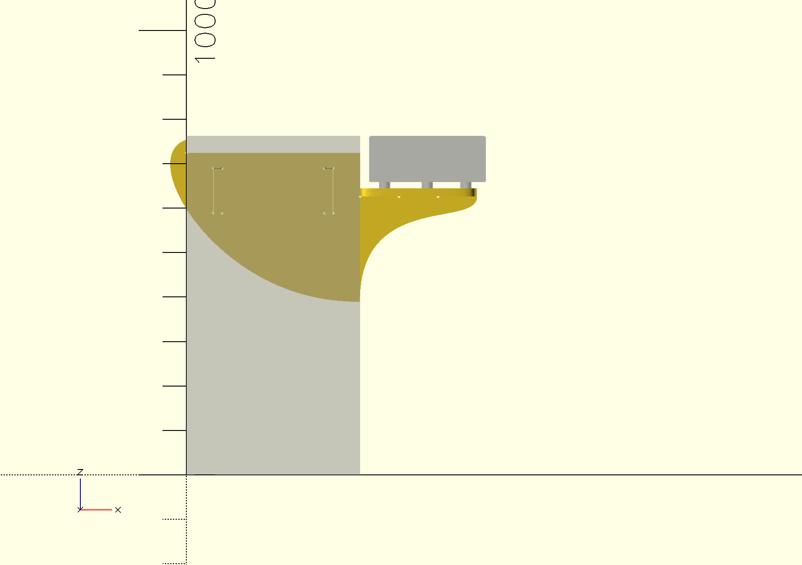
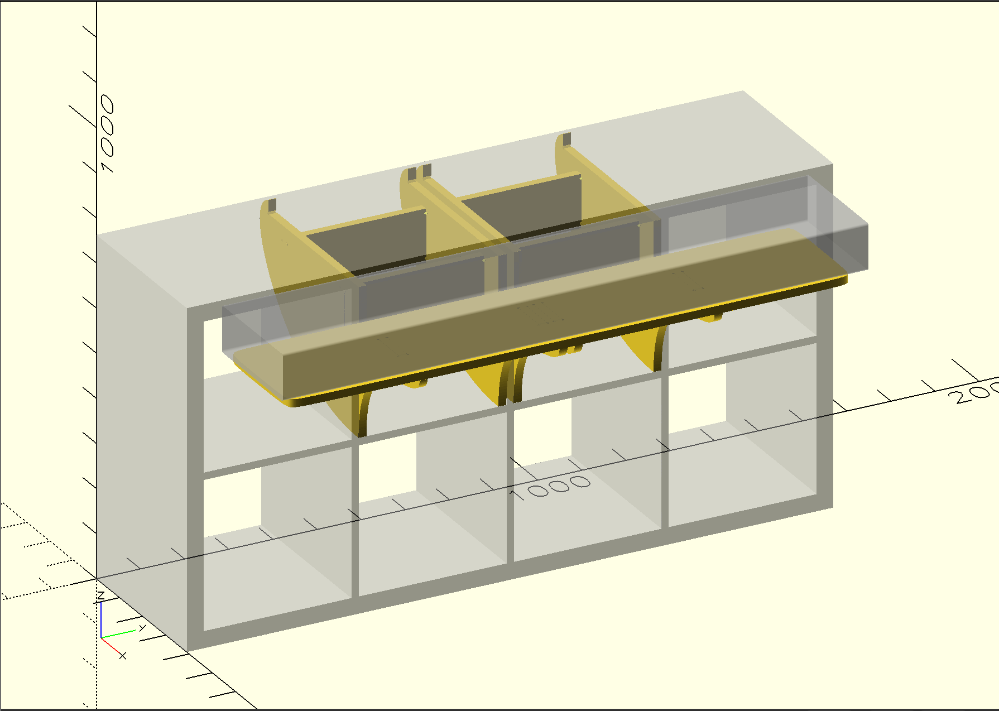
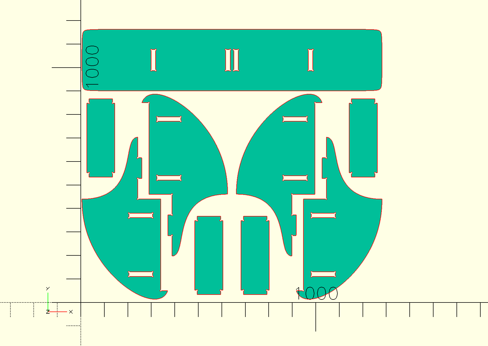
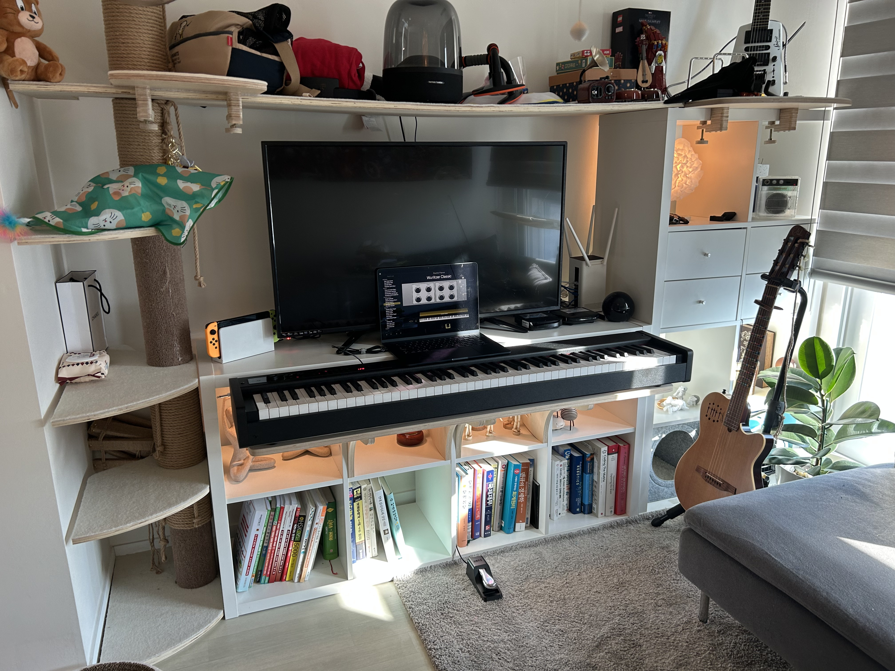
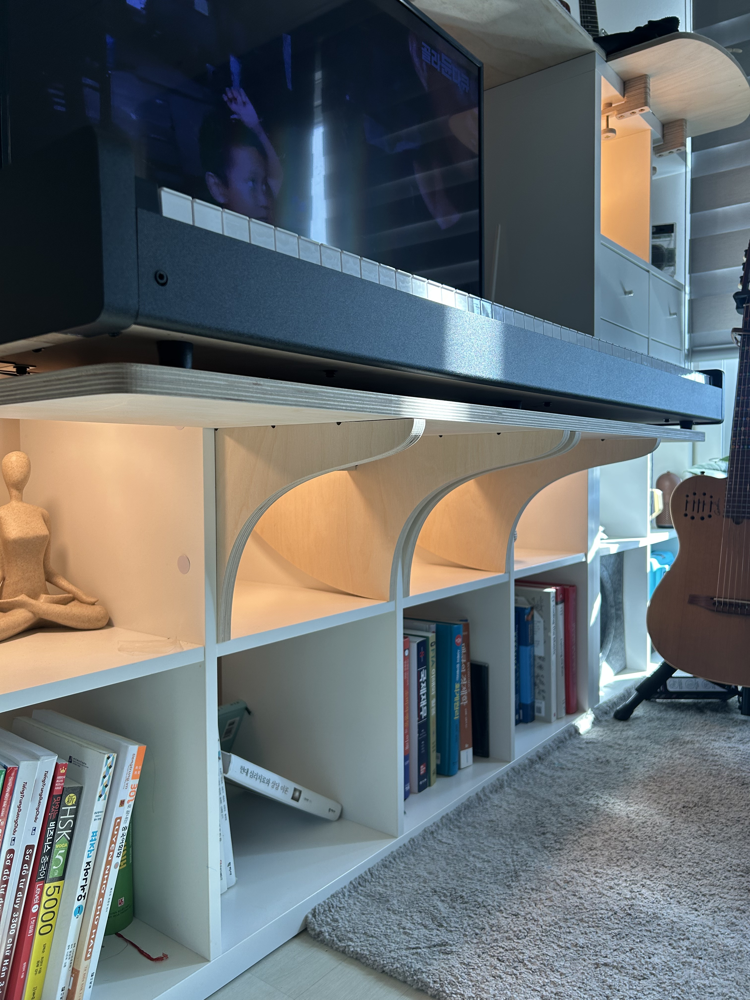

# Kallax Keyboard Stand Extension

This is a furniture design that extends an IKEA Kallax shelf unit to create a keyboard stand. The design was born from my personal need to fit a keyboard setup into my tiny living space.

## Preview

*3D rendering of the assembly*

*Another view of the 3D model*

*2D cutting layout for manufacturing*

## Real Build

*The keyboard stand installed on Kallax shelf*

*Bottom of the installed stand*

## Files

- `keyboard_stand.scad`: OpenSCAD source file
- `keyboard_stand.dxf`: DXF file for manufacturing

## Requirements

- [OpenSCAD](https://openscad.org/)
- [BOSL2 Library](https://github.com/revarbat/BOSL2)
- IKEA Kallax shelf unit
- 18mm plywood

## Disclaimer

The design includes a [relatively large tolerance (0.5mm)](https://github.com/jinhwanlazy/kallax-keyboard-stand/blob/main/keyboard_stand.scad#L11) for the joints as I was uncertain about the material quality and milling precision. As a result, the joints turned out to be slightly loose. If you plan to build this yourself, carefully adjust the tolerance parameter and consult with your milling service provider about their precision capabilities.

The design parameters are specifically set for the Korg D1 keyboard shown in the pictures. While the design is parametric, I cannot guarantee it will work correctly with other dimensions as I don't have the resources to test different configurations. If you want to adapt this for a different keyboard, measure your keyboard's dimensions carefully and update the parameters accordingly.

## License

MIT License

Copyright (c) 2023 Jinhwan Choi

Permission is hereby granted, free of charge, to any person obtaining a copy
of this software and associated documentation files (the "Software"), to deal
in the Software without restriction, including without limitation the rights
to use, copy, modify, merge, publish, distribute, sublicense, and/or sell
copies of the Software, and to permit persons to whom the Software is
furnished to do so, subject to the following conditions:

The above copyright notice and this permission notice shall be included in all
copies or substantial portions of the Software.

THE SOFTWARE IS PROVIDED "AS IS", WITHOUT WARRANTY OF ANY KIND, EXPRESS OR
IMPLIED, INCLUDING BUT NOT LIMITED TO THE WARRANTIES OF MERCHANTABILITY,
FITNESS FOR A PARTICULAR PURPOSE AND NONINFRINGEMENT. IN NO EVENT SHALL THE
AUTHORS OR COPYRIGHT HOLDERS BE LIABLE FOR ANY CLAIM, DAMAGES OR OTHER
LIABILITY, WHETHER IN AN ACTION OF CONTRACT, TORT OR OTHERWISE, ARISING FROM,
OUT OF OR IN CONNECTION WITH THE SOFTWARE OR THE USE OR OTHER DEALINGS IN THE
SOFTWARE.

